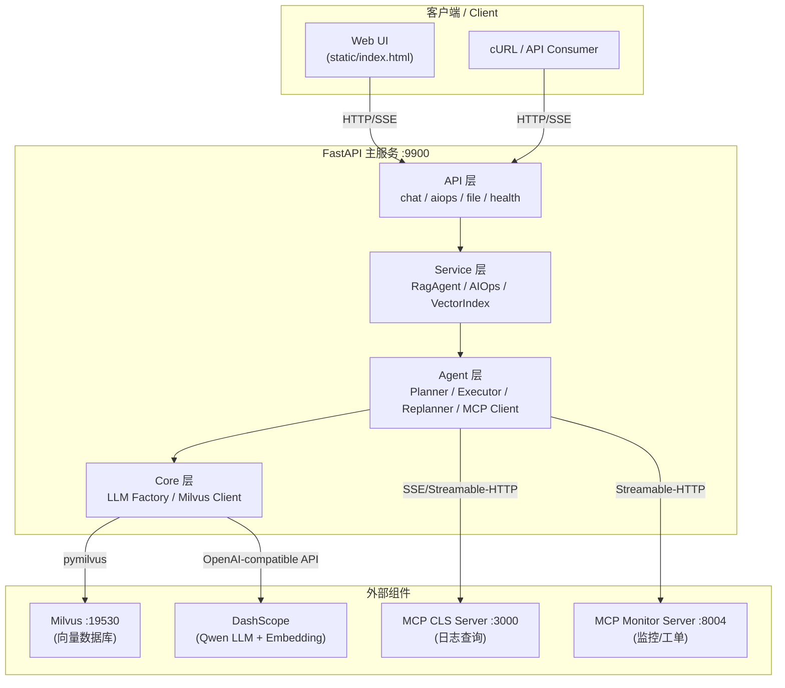
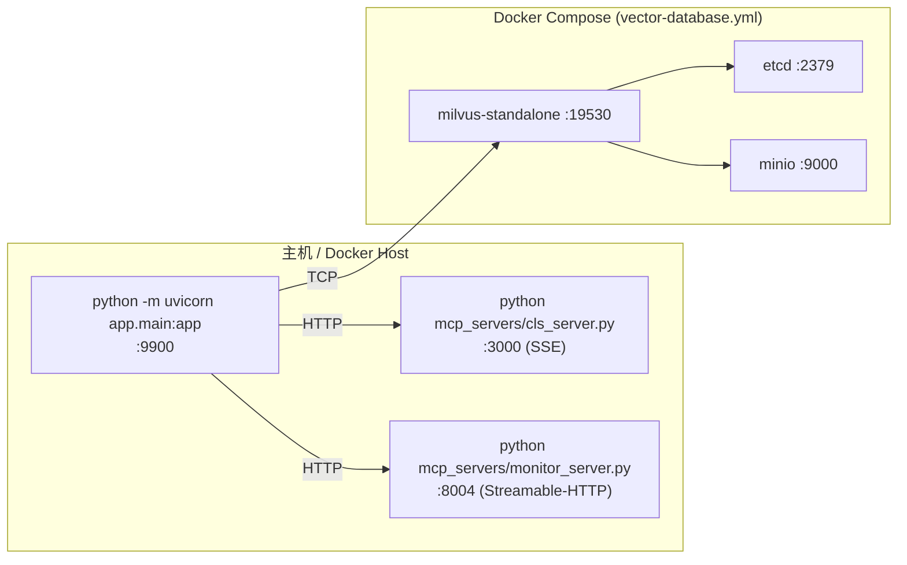
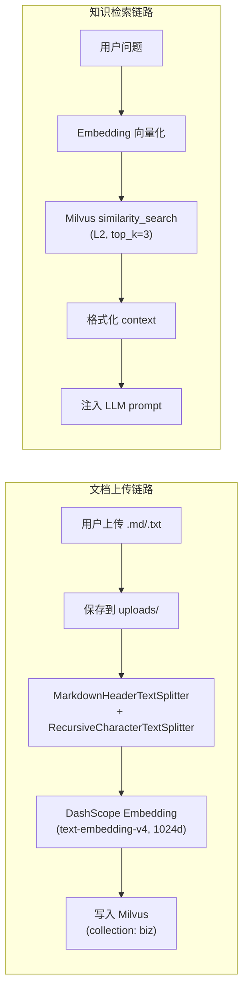
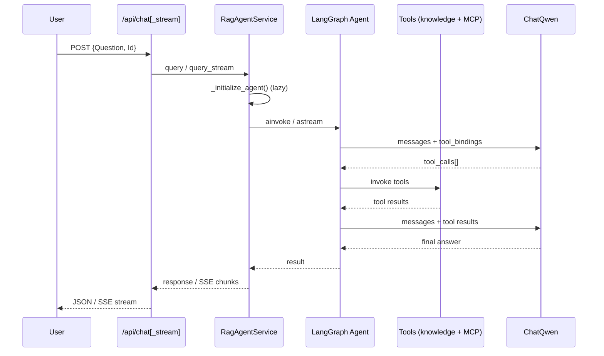
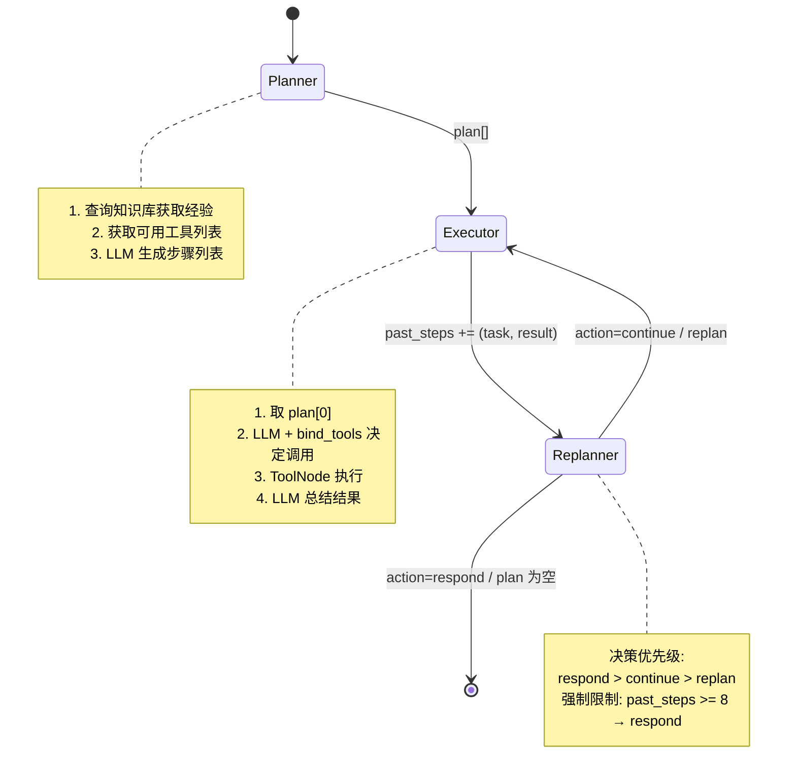
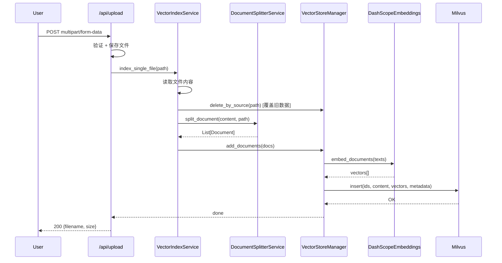
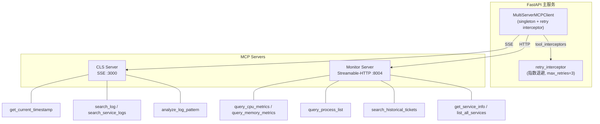
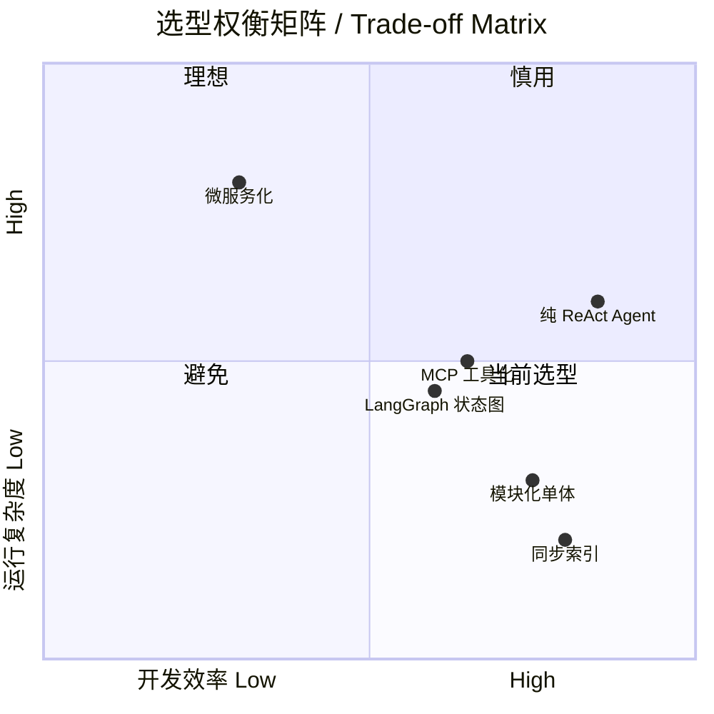
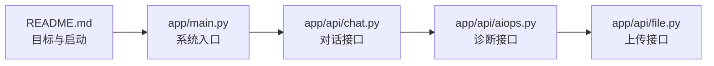
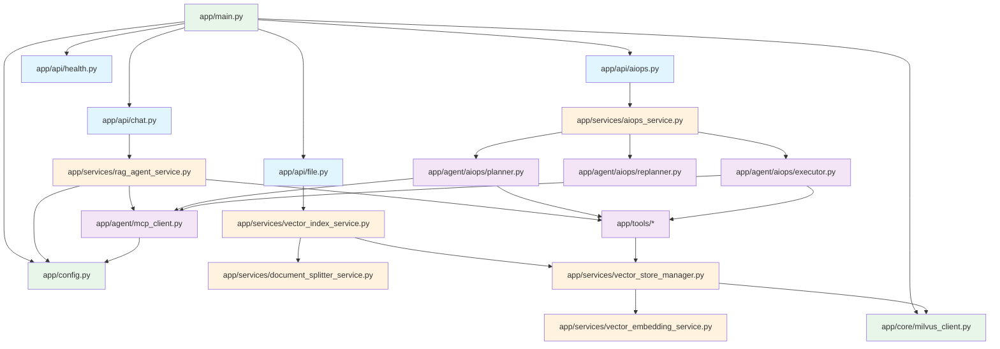

# SuperBizAgent 项目全貌导读 / SuperBizAgent Project Overview

> 基于 repo-guide skill 自动生成，代码证据截至 2026-06-07

---

## 1. 项目定位 / Project Positioning

**一句话**：面向企业运维场景的 AI 助手，将 RAG 知识库问答与 AIOps 自动诊断融合在同一服务中，实现"问答→检索→诊断→报告"全流程自动化。

**One-liner**: An enterprise AIOps assistant that unifies RAG-based knowledge Q&A and automated fault diagnosis into a single service, delivering end-to-end "query → retrieval → diagnosis → report" automation.

---

## 2. 架构总览 / Architecture Overview

### 2.1 系统分层图 / Layered Architecture

### 2.2 运行时部署图 / Deployment Diagram

### 2.3 核心数据流图 / Data Flow

---

## 3. 核心调用链 / Core Call Chains

### 3.1 RAG 对话链路 / RAG Chat Flow

**关键文件 / Key Files**:
- 入口: `app/api/chat.py`
- 编排: `app/services/rag_agent_service.py`
- 工具: `app/tools/knowledge_tool.py`, `app/tools/time_tool.py`

### 3.2 AIOps 诊断链路 / AIOps Diagnosis Flow

**关键文件 / Key Files**:
- API: `app/api/aiops.py`
- 编排: `app/services/aiops_service.py`
- 状态定义: `app/agent/aiops/state.py`
- Planner: `app/agent/aiops/planner.py`
- Executor: `app/agent/aiops/executor.py`
- Replanner: `app/agent/aiops/replanner.py`

### 3.3 文档索引链路 / Document Indexing Flow

### 3.4 MCP 工具接入链路 / MCP Tool Integration

---

## 4. 关键模块表 / Key Modules

| 模块 Module | 职责 Responsibility | 关键文件 Key File | 上下游依赖 Dependencies | 扩展点 Extension Points |
|---|---|---|---|---|
| 应用入口 Entry | 生命周期、路由注册、静态文件 | `app/main.py` | FastAPI, milvus_manager | 中间件、生命周期钩子 |
| 配置中心 Config | 环境变量 + MCP 服务器配置 | `app/config.py` | pydantic-settings, .env | 多环境配置、密钥管理 |
| RAG Agent | 对话编排、工具调用、会话记忆 | `app/services/rag_agent_service.py` | LangGraph, ChatQwen, MCP | 系统提示词、工具集、消息修剪 |
| AIOps 编排 | Plan-Execute-Replan 状态机 | `app/services/aiops_service.py` | LangGraph StateGraph | 新节点、条件边、输出格式 |
| Planner | 基于经验 + 工具列表生成计划 | `app/agent/aiops/planner.py` | retrieve_knowledge, MCP tools | 提示词、规划策略 |
| Executor | 执行单步，绑定工具 + ToolNode | `app/agent/aiops/executor.py` | ChatQwen, ToolNode | 并行执行、超时控制 |
| Replanner | 决策：继续/重规划/响应 | `app/agent/aiops/replanner.py` | ChatQwen | 决策阈值、强制终止条件 |
| MCP 客户端 | 多服务器连接 + 重试拦截 | `app/agent/mcp_client.py` | langchain-mcp-adapters | 拦截器链、服务发现 |
| 向量索引 | 文件分割→嵌入→入库 | `app/services/vector_index_service.py` | splitter, vector_store_manager | 批量索引、增量更新 |
| 文档分割 | Markdown 两阶段分割 + 合并 | `app/services/document_splitter_service.py` | langchain-text-splitters | 分割策略、最小分片阈值 |
| 向量存储 | Milvus VectorStore CRUD | `app/services/vector_store_manager.py` | langchain-milvus | 集合管理、检索参数 |
| 向量嵌入 | DashScope Embedding 标准接口 | `app/services/vector_embedding_service.py` | openai SDK (compat) | 模型/维度切换 |
| Milvus 管理 | 连接池 + Schema 自动创建 | `app/core/milvus_client.py` | pymilvus | 多集合、连接策略 |
| LLM 工厂 | OpenAI-compat 模式 LLM 创建 | `app/core/llm_factory.py` | langchain-openai | 多模型供应商切换 |
| MCP CLS | 日志查询工具服务 | `mcp_servers/cls_server.py` | fastmcp | 接入腾讯云 CLS SDK |
| MCP Monitor | 监控/工单查询工具服务 | `mcp_servers/monitor_server.py` | fastmcp | 接入 Prometheus/Grafana |
| Web 前端 | 纯静态 SPA (无框架) | `static/` | 无 | 可替换为 React/Vue |

---

## 5. 技术栈与选型权衡 / Tech Stack & Trade-offs

### 5.1 关键依赖 / Key Dependencies (from pyproject.toml)

| 依赖 | 版本范围 | 用途 |
|---|---|---|
| fastapi | ≥0.109 | Web 框架 + SSE |
| langgraph | ≥0.0.40 | Agent 状态图编排 |
| langchain / langchain-core | ≥0.1.0 | 工具/链/消息抽象 |
| langchain-mcp-adapters | ≥0.2.1 | MCP 协议接入 |
| langchain-qwq | ≥0.3.4 | ChatQwen 原生集成 |
| pymilvus | ≥2.3.5 | 向量数据库客户端 |
| dashscope | ≥1.14 | DashScope SDK |
| fastmcp | ≥2.14 | MCP 服务端框架 |
| pydantic-settings | ≥2.1 | 类型安全配置 |
| loguru | ≥0.7.2 | 结构化日志 |

### 5.2 架构风格判断

**模块化单体 + 工具微服务**
- 主服务是单进程 FastAPI（内含 RAG + AIOps 两条业务线）
- MCP Server 是轻量独立进程，可按需横向扩展
- Docker Compose 只承载基础设施（Milvus/etcd/MinIO）

### 5.3 选型权衡 / Design Trade-offs

| # | 权衡 Trade-off | 当前选择 | 代价 |
|---|---|---|---|
| 1 | 模块化单体 vs 微服务 | 单体 | 扩展性受限，但部署简单 |
| 2 | LangGraph 状态图 vs 自由 ReAct | 状态图 | 设计成本高，但可控可观测 |
| 3 | MCP 工具协议 vs 直连 SDK | MCP | 多一跳网络延迟，但解耦彻底 |
| 4 | 同步索引 vs 异步队列 | 同步 | 大文件阻塞请求，但实现简单 |

---

## 6. 学习路径 / Learning Path

### 30 分钟速览 / 30-min Quick Tour

目标：理解项目做什么、怎么跑、有哪些 API。

### 2 小时深入 / 2-hour Deep Dive

| 顺序 | 文件 | 关注点 |
|---|---|---|
| 1 | `app/services/rag_agent_service.py` | Agent 如何初始化工具、如何流式输出 |
| 2 | `app/services/aiops_service.py` | StateGraph 的构建与条件边 |
| 3 | `app/agent/aiops/planner.py` | 经验检索 + 工具描述 → 结构化计划 |
| 4 | `app/agent/aiops/executor.py` | ToolNode 自动工具调用 |
| 5 | `app/agent/mcp_client.py` | 单例 + 重试拦截器模式 |
| 6 | `app/services/vector_index_service.py` | 分割→嵌入→入库全链路 |

### 1 天掌握 / 1-day Mastery

1. 从一次真实请求走读日志（chat/aiops/upload 各跑一次，看 `logs/app_*.log`）
2. 追踪配置流：`.env` → `app/config.py` → 各模块使用点
3. 动手实验：在 `mcp_servers/monitor_server.py` 添加一个新工具，观察 Planner 如何自动发现
4. 阅读 `app/services/document_splitter_service.py` 理解分割策略
5. 尝试修改 Replanner 的 `MAX_STEPS` 观察行为变化
6. 补充一个集成测试：模拟上传→检索→验证结果

---

## 7. 风险与技术债 / Risks & Tech Debt

| 优先级 | 问题 | 影响 | 建议 |
|---|---|---|---|
| 🔴 高 | 同步索引阻塞上传接口 | 大文件/并发场景超时 | 引入任务队列（Celery/ARQ） |
| 🔴 高 | 无测试目录，自动化回归缺失 | 重构风险高 | 补充 pytest 集成测试 |
| 🟡 中 | MCP 默认配置 vs 文档示例不一致 | CLS 端口：代码 3000 vs 文档 8003 | 统一到 config.py |
| 🟡 中 | 全局单例初始化时机耦合 | vector_store_manager 模块加载即连接 | 延迟初始化或依赖注入 |
| 🟡 中 | Replanner 决策依赖 LLM 输出格式 | 解析失败导致死循环 | 增加 fallback + 超时熔断 |
| 🟢 低 | CORS 配置 allow_origins=["*"] | 安全风险（生产环境） | 收敛到具体域名 |
| 🟢 低 | 日志仅本地文件输出 | 多实例场景不便查询 | 接入集中式日志系统 |

---

## 8. 下一步建议 / Next Steps

### 推荐阅读顺序（带目的）

| # | 文件 | 你将理解 |
|---|---|---|
| 1 | `app/main.py` | 系统如何启动和组装 |
| 2 | `app/config.py` | 所有可调参数在哪 |
| 3 | `app/api/chat.py` | 请求如何进入系统 |
| 4 | `app/services/rag_agent_service.py` | Agent 完整生命周期 |
| 5 | `app/api/aiops.py` | SSE 流式返回协议 |
| 6 | `app/services/aiops_service.py` | LangGraph 状态图实战 |
| 7 | `app/agent/aiops/planner.py` | 经验驱动的规划设计 |
| 8 | `app/agent/aiops/executor.py` | ToolNode 自动执行 |
| 9 | `app/agent/aiops/replanner.py` | 决策逻辑与强制终止 |
| 10 | `app/api/file.py` | 上传链路入口 |
| 11 | `app/services/vector_index_service.py` | 索引全流程 |
| 12 | `app/services/document_splitter_service.py` | 智能分割策略 |
| 13 | `app/services/vector_store_manager.py` | Milvus 操作封装 |
| 14 | `app/agent/mcp_client.py` | MCP 连接与重试 |
| 15 | `mcp_servers/cls_server.py` | 工具实现示例 |
| 16 | `mcp_servers/monitor_server.py` | 监控工具实现 |

### 想加功能？从这里入手

| 场景 | 入手点 |
|---|---|
| 新增一种诊断工具 | `mcp_servers/` 添加工具函数，Agent 自动发现 |
| 支持新文档格式（PDF） | `document_splitter_service.py` 扩展 `split_document()` |
| 切换 LLM 供应商 | `app/core/llm_factory.py` 修改 `base_url` |
| 增加对话历史持久化 | `rag_agent_service.py` 替换 `MemorySaver` 为 DB-backed checkpointer |
| 增加 AIOps 诊断节点 | `aiops_service.py` 在 `_build_graph()` 中添加节点和边 |

---

## 附录: 完整模块依赖图 / Appendix: Full Module Dependency Graph

图例 / Legend:
- 🔵 蓝色 = API 层
- 🟠 橙色 = Service 层
- 🟣 紫色 = Agent 层
- 🟢 绿色 = Core 层
